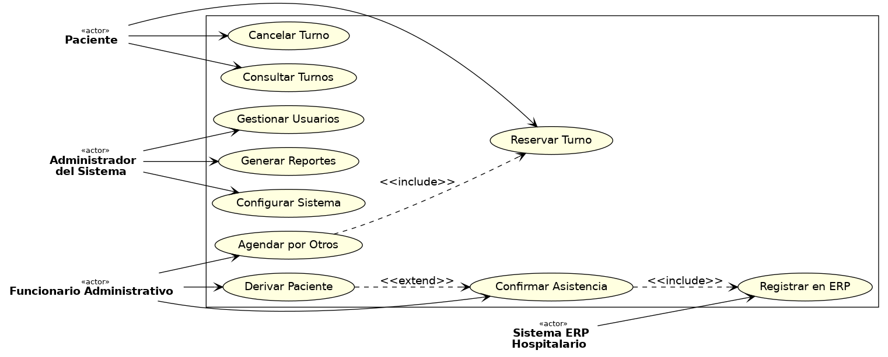
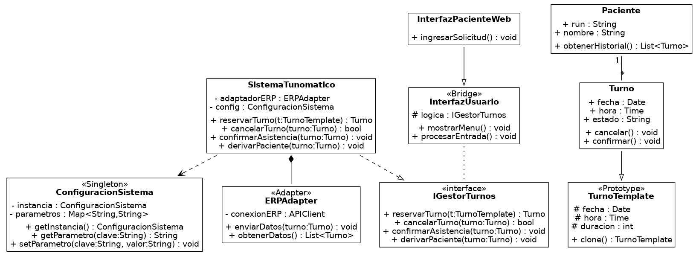
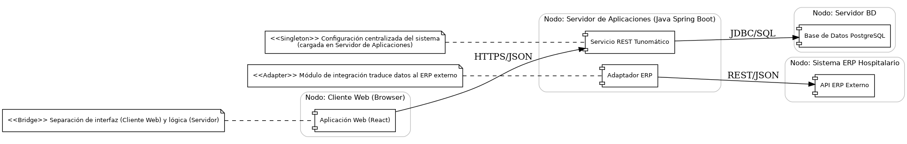

🏥 Sistema Tunomático — Modelado Arquitectónico Profesional

📝 Descripción General

Tunomático es un sistema digital de agendamiento de turnos médicos que permite a pacientes, funcionarios administrativos y administradores gestionar citas, confirmar asistencia y mantener la trazabilidad integrada con un ERP hospitalario. Está diseñado con una arquitectura basada en patrones de diseño clásicos que garantizan flexibilidad, escalabilidad y claridad.

🔷 Diagrama de Casos de Uso UML

Actores:

Paciente: Reserva, consulta, cancela turnos.

Funcionario Administrativo: Deriva pacientes, agenda por otros, confirma asistencia.

Administrador del Sistema: Configura parámetros, genera reportes, gestiona usuarios.

Sistema ERP Hospitalario: Sistema externo conectado.

Casos clave:

Reservar, cancelar, derivar turnos.

Confirmar asistencia (<<extend>> desde derivación).

Registrar en ERP (<<include>> en confirmar asistencia).

Agendar por otros (<<include>> en reservar).

📘 Diagrama de Clases UML con Patrones Aplicados

Patrones Aplicados:

«Singleton»: ConfiguracionSistema

«Prototype»: TurnoTemplate

«Adapter»: ERPAdapter

«Bridge»: InterfazUsuario + variantes de interfaz

Clases destacadas:

SistemaTunomatico: Orquesta operaciones con turnos.

Paciente y Funcionario heredan de Usuario.

Turno y TurnoTemplate gestionan estados y clonación.

ERPAdapter se comunica con SistemaERP.

ConfiguracionSistema garantiza instancia única.

InterfazUsuario abstrae entrada de usuario.

🏗️ Diagrama de Implementación UML

Nodos:

Cliente Web: App React que consume servicios vía HTTPS/JSON.

Servidor de Aplicaciones (Java Spring Boot): Aloja lógica del sistema.

Base de Datos: PostgreSQL accedida vía JDBC/SQL.

Sistema ERP Hospitalario: Interacción REST/JSON.

Componentes Clave:

Servicio REST Tunomático: expone funcionalidades.

Adaptador ERP: integra ERP externo.

ConfiguraciónSistema: centraliza parámetros.

Patrones reflejados:

«Singleton», «Adapter», «Bridge» documentados dentro del diseño.

🧠 Conclusión

El sistema Tunomático representa un ejemplo completo y profesional de arquitectura basada en UML y patrones de diseño. Permite visualizar tanto la lógica de negocio como su despliegue físico, facilitando su implementación y mantenimiento.

✅ Modularidad clara

✅ Alta cohesión y bajo acoplamiento

✅ Escalabilidad garantizada

✅ Cumplimiento de buenas prácticas académicas

📁 Repositorio estructurado con diagramas e imágenes listos para entrega profesional.
